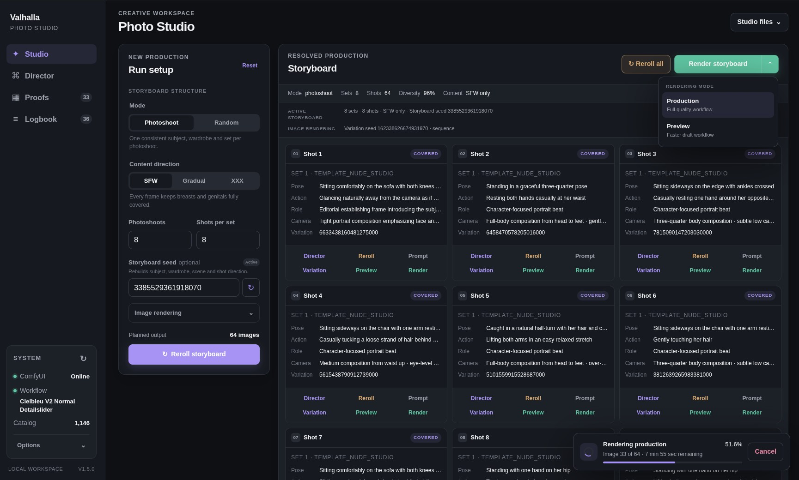
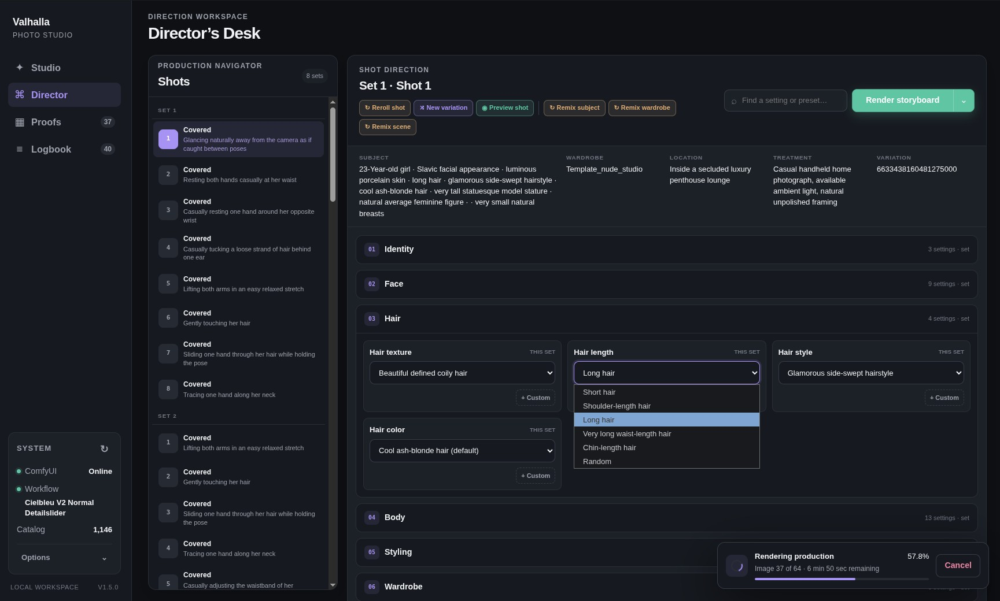
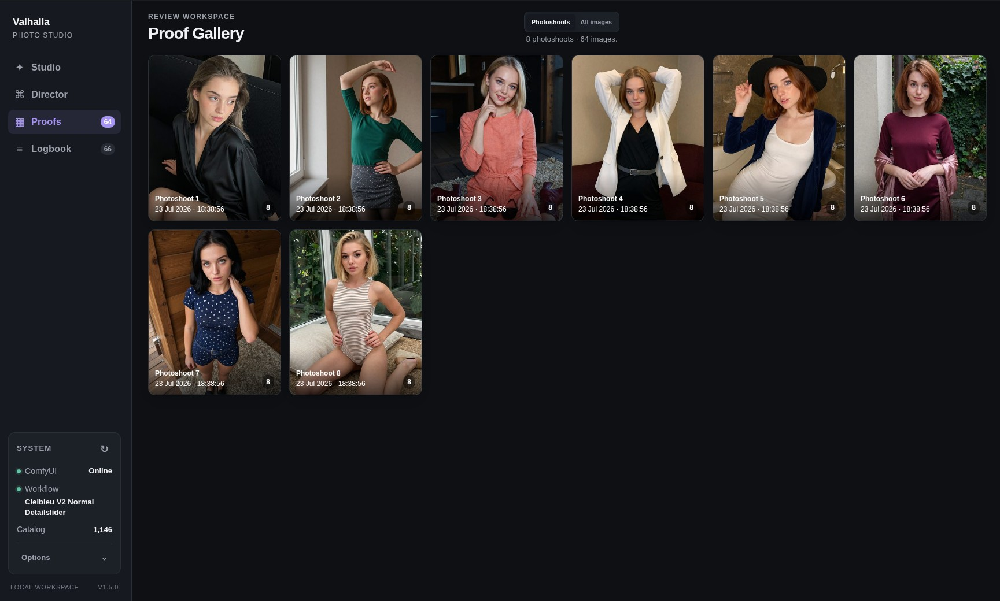
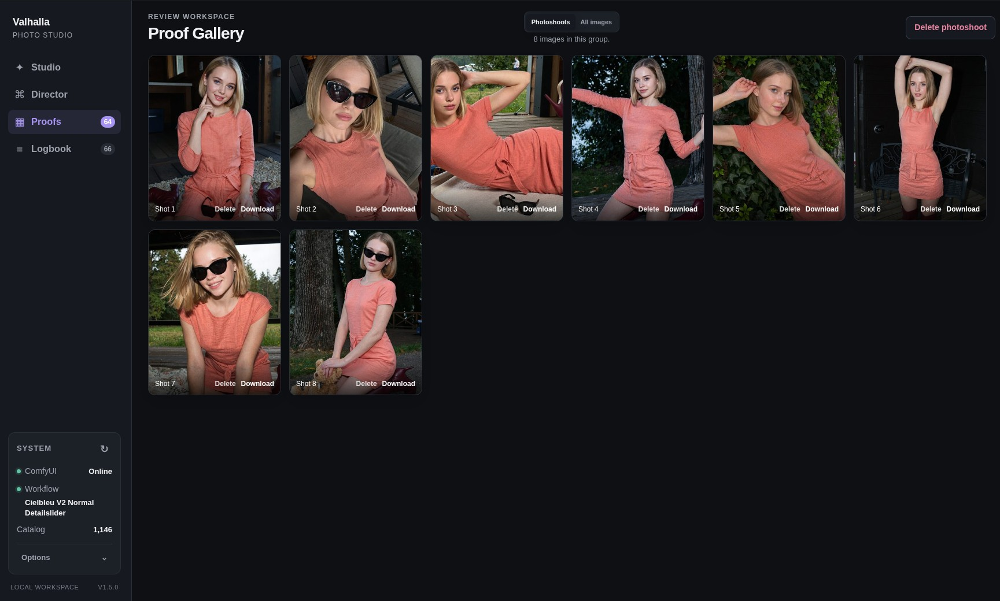
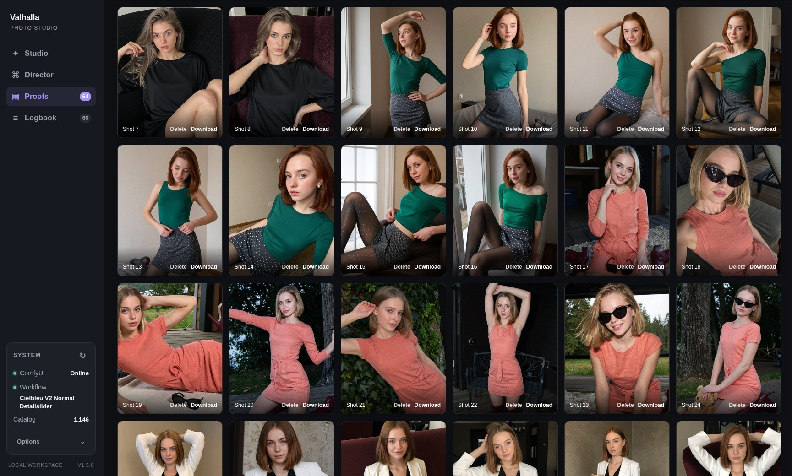
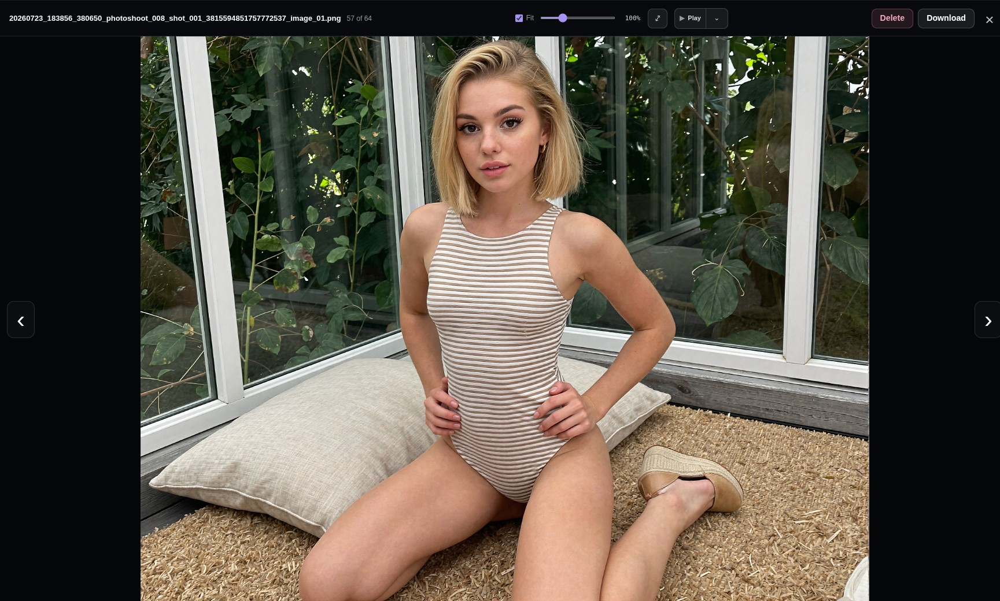
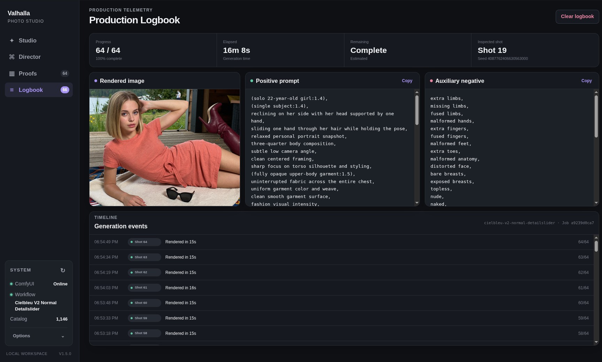
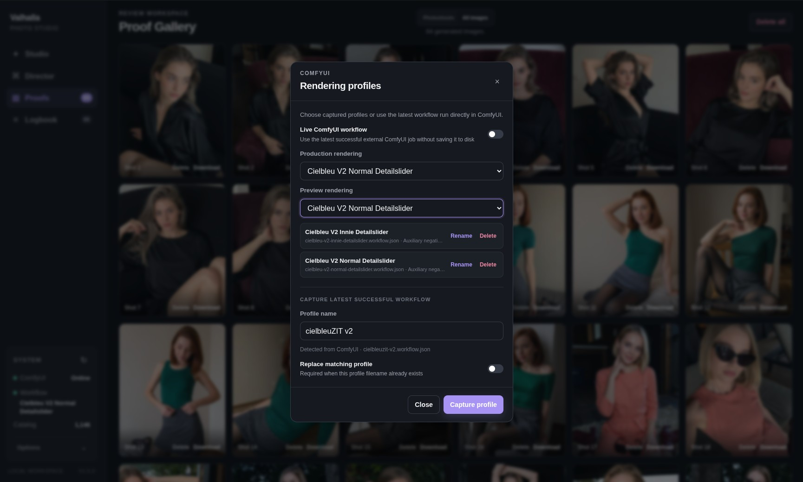

# Valhalla Photo Studio

Valhalla Photo Studio 1.5 is a local production workspace for generating coherent SFW and NSFW photoshoots of adult women with your own ComfyUI instance. It turns creative direction into complete, automatically composed prompts, keeps the subject and visual story consistent across a set, and sends the approved shots to ComfyUI for image inference.

The browser interface brings the full workflow together: storyboard planning, prompt automation, compatible scene and wardrobe selection, shot-level direction, Preview and Production rendering, progress tracking, and a built-in gallery manager for organizing and reviewing the resulting images. Every rule-compatible storyboard is resolved before GPU work begins, so poses, wardrobe, scene geometry, camera direction, content progression, prompts, and seeds can be inspected or edited before an expensive render.

The application is designed for a private workstation or trusted LAN. It has no cloud service, account system, telemetry, or built-in authentication.

> **Adult-content notice:** the production catalog supports SFW, progressive adult, and explicit solo-adult modes. All configured subjects are adults aged 21–23. Use the application only where its content is lawful and appropriate.

## Highlights

- **Review before render:** resolve complete storyboards without GPU work, inspect every prompt and seed, then render only when the plan is ready.
- **Coherent photoshoots:** keep the subject, wardrobe, palette, location, mood, and visual treatment fixed while compatible poses and camera direction evolve.
- **Three content modes:** enforced SFW-only, configurable progressive content, and Full XXX editorial arcs.
- **Director’s Desk:** edit compatible subject traits, wardrobe, stages, poses, actions, expressions, locations, surfaces, camera grammar, and explicit recipes at set or shot scope.
- **Deterministic production:** Storyboard seeds reproduce composition; separate image-variation seeds reproduce or vary rendered pixels.
- **Named ComfyUI profiles:** capture, validate, rename, and select independent Production and Preview workflows without manually editing workflow JSON.
- **Fast Preview:** render smaller temporary drafts while preserving the selected workflow’s base sampler, LoRA chain, CLIP path, and VAE.
- **Reliable job handling:** cancellable FIFO render queue, per-frame progress and ETA, reload-safe Logbook state, and clear first-error failure reporting.
- **Production gallery:** virtualized thumbnails, photoshoot grouping, persistent thumbnail scaling (slider or Ctrl/Cmd + wheel), fullscreen inspection, zoom, slideshow, downloads, and confirmed deletion.
- **Privacy controls:** instantly hide decoded images and prompts with a configurable shortcut or inactivity timer; covering never deletes files or cancels renders.
- **Validated catalog:** more than 1,100 subject, wardrobe, location, direction, camera, and treatment records with exact reachability analysis.

## Interface tour

### Plan and direct

| Photo Studio | Director's Desk |
|---|---|
| [](screenshots/1-studio.jpg) | [](screenshots/2-director.jpg) |
| Resolve and review complete productions before committing GPU time. | Refine subject, wardrobe, scene, camera, and shot direction with compatible controls. |

### Review coherent photoshoots

| Photoshoot overview | One complete photoshoot |
|---|---|
| [](screenshots/3-proofs-photoshoots.jpg) | [](screenshots/4-proofs-photoshoot.jpg) |
| Browse large productions as recognizable sets. | Open a set to inspect, download, or manage its individual shots. |

### Browse and inspect outputs

| All images | Fullscreen lightbox |
|---|---|
| [](screenshots/5-proofs-all-images.jpg) | [](screenshots/6-proofs-lightbox.jpg) |
| Move through the complete virtualized output collection. | Inspect full images with fit, zoom, navigation, slideshow, download, and deletion controls. |

### Monitor and configure production

| Production Logbook | Rendering profiles |
|---|---|
| [](screenshots/7-logbook.jpg) | [](screenshots/8-rendering-profiles.jpg) |
| Track progress, timing, outputs, prompts, seeds, and generation events. | Capture and select independent ComfyUI workflows for Production and Preview. |

## Requirements

- Linux or another environment capable of running the included POSIX `launcher.sh`
- Python 3.11 or newer
- ComfyUI reachable locally or on a trusted LAN
- a modern browser
- a working ComfyUI image-generation workflow

The launcher installs the two Python packages used at runtime if necessary:

- `requests`
- `Pillow`

ComfyUI defaults to `http://127.0.0.1:8188`. Valhalla defaults to port `8765` and may be restricted to loopback or exposed to a trusted LAN through `config.json`.

## Quick start

1. Start ComfyUI and successfully run the workflow you want Valhalla to control.
2. From the project directory, start Valhalla:

   ```bash
   ./launcher.sh
   ```

3. Open **System → Rendering profiles** in Valhalla.
4. Capture the latest successful ComfyUI workflow, give it a clear profile name, and select it for Production and Preview.
5. Configure a batch in **Studio**, then choose **Resolve storyboard**.
6. Review the planned shots or refine them in **Director**.
7. Choose **Preview storyboard** for drafts or **Render storyboard** for full production.

The launcher opens the Web UI automatically. It detects an existing server process belonging to this project and asks before stopping it. It never kills an unrelated Python process.

Direct startup is also available:

```bash
python3 server.py
python3 server.py --host 127.0.0.1 --port 9000
python3 server.py --no-browser
```

Stop the server with `Ctrl+C`. Closing the browser does not stop the server or an active render job.

## Rendering profiles

Valhalla renders through named ComfyUI API workflows stored in `workflows/`. A profile is captured from the latest successful ComfyUI history entry and validated before it can be selected.

A usable profile must expose unambiguous nodes for:

- positive conditioning;
- seed control;
- the main sampler and latent input;
- VAE decoding;
- image output.

Negative conditioning is optional. If a workflow has no connected negative text encoder, Valhalla treats its positive prompt as the complete structural source of truth.

Production and Preview may use the same profile or different profiles. Preview reduces the detected latent dimensions to `comfy.preview_max_edge` while keeping orientation and approximate aspect ratio. It prunes downstream refiners/detailers but deliberately retains upstream LoRA nodes because they are part of the visual design.

If `comfy.workflow_source` is set to `live`, Valhalla reads the latest compatible ComfyUI workflow instead of the selected saved profiles. Saved profiles are recommended for reproducible production.

## Production workflow

### Modes

- **Photoshoot** creates coherent sets with progressive, non-reversing garment and content stages.
- **Random** rebuilds the subject context and scene for every frame.
- **SFW only** server-enforces fully covered stages and removes incompatible garments, actions, poses, intensities, and imports.
- **Full XXX** starts explicitly and plans a seeded editorial arc across concrete recipe, pose, action, camera, and intensity families, reserving a compatible peak closing frame.

### Seeds

- **Storyboard seed** controls the complete compositional plan.
- **Image variation seed** changes rendered pixels without rebuilding direction.
- Variation can be fixed, fresh for every frame, or deterministically derived per photoshoot and shot.

Storyboard export stores the selected catalog IDs, workflow profile, prompts, and effective seeds. Imports are accepted only when their semantic database fingerprint matches the current catalog.

### Rendering and outputs

Production jobs are immutable snapshots placed in a FIFO queue. Cancellation takes effect between images. Generated images are written to `storage.output_dir`; temporary shot previews remain in memory and are discarded when closed.

Output deletion is permanent and requires confirmation. Deletion is disabled while a render job is active. Restarting Valhalla clears in-memory planning and job history but never removes generated files.

## Configuration

Runtime settings live in `config.json`. Relative paths are resolved from the project directory.

| Section | Important settings |
|---|---|
| `server` | listen host and port; keep loopback unless trusted-LAN access is required |
| `comfy` | ComfyUI URL, workflow source, profiles directory, Production/Preview selections, timeouts, Preview size |
| `storage` | output directory, additional proof directories, PNG/JPEG output, JPEG quality, EXIF stripping |
| `gallery` | thumbnail size and bounded in-memory thumbnail cache |
| `interface` | privacy auto-cover intervals |
| `limits` | scene retries and retained in-memory storyboards, jobs, and previews |

Restart the server after editing `config.json`. The application has no authentication, so do not bind it to an untrusted network.

Creative records and selection rules live in `database.json`, not `config.json`. Records can be temporarily removed from selection with `"disabled": true`.

## Validation and catalog statistics

Run the complete GPU-free production audit before a large render batch or after changing `database.json`:

```bash
./launcher.sh validate
# equivalent: python3 server.py validate
```

Validation checks configuration and catalog structure, exact record reachability, every outfit/interior combination, SFW contracts, garment transitions, representative storyboards in every mode, all explicit recipes, and 10,000 camera-grammar scenes. It never contacts ComfyUI or writes outputs. Proven failures return a non-zero exit code; finite-sample gaps are warnings only when the exact analyzer proves a valid route.

Inspect diversity and narrow candidate pools with:

```bash
./launcher.sh stats
# equivalent: python3 server.py stats
```

Statistics include record and tag counts, manual versus automatic reachability, recipe coverage, and minimum/median/maximum garment-slot and furniture pools.

Run the regression suite with:

```bash
PYTHONPATH=.:tests python3 -m unittest discover -s tests
```

## Project layout

```text
server.py       composition engine, ComfyUI client, HTTP server, validation CLI
client/         browser interface
database.json   creative catalog and compatibility rules
config.json     local runtime configuration
workflows/      captured ComfyUI rendering profiles
outputs/        default production output directory
launcher.sh     dependency check and application launcher
tests/          deterministic regression and stress tests
```

## Privacy and operational boundaries

- Everything runs locally unless `config.json` points to another trusted ComfyUI host.
- The privacy cover hides images and prompts in the UI; it is not encryption or access control.
- Server and storyboard state is held in memory; generated image files remain on disk.
- Valhalla does not include an image-quality detector or identity/reference-image pipeline.
- ComfyUI errors and invalid workflows are reported before or during the affected job without silently skipping failed frames.
